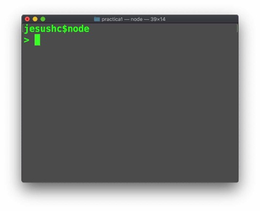
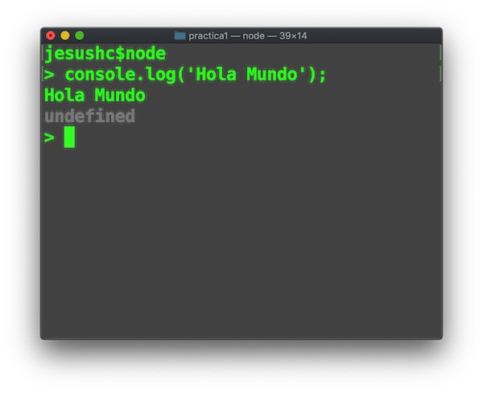
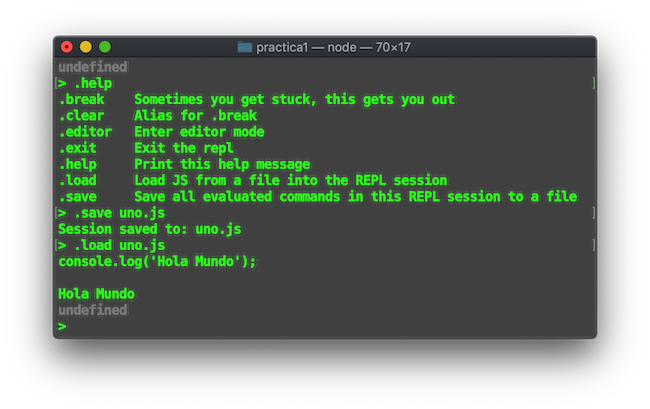
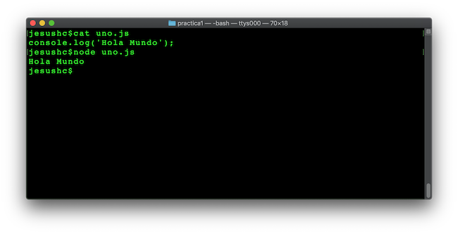
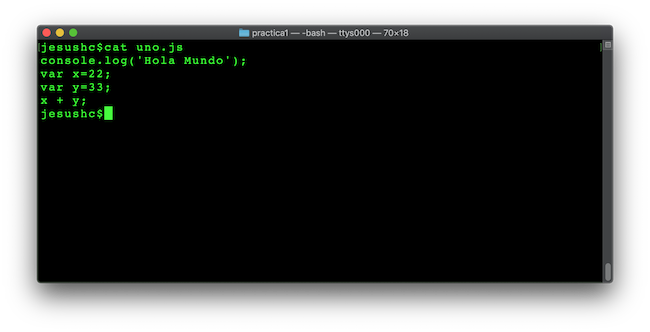
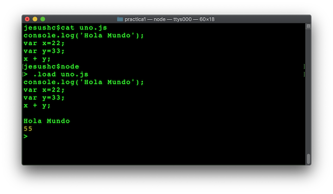
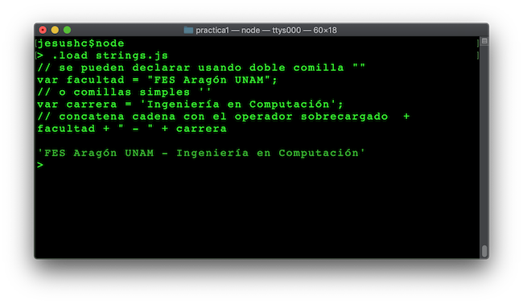

# Consola Node Js
### Usar una consola Linux, si estas usando Windows, emplea la consola ``` Git Bash ``` que proporciona la inctalación del cliente ```git ```

1.- Iniciar la consola node Js



2.- Escribir clásico hola mundo



3.- Desplegar la ayuda con ``` .help ```


4.- Guardar los comandos de la sesion actual con ``` .save [nombre archivo].js ```


5.- Cargar el archivo y ejecutarlo ``` .load [nombre archivo].js  ```



6.- Salirse con ```.exit ```


7.- Mostrar el contenido


8.- Ejecuta el archivo desde el prompt



9.- Modifica el archivo para que tenga el sigiente contenido:



10.- Entra a la consola ``` $node ``` y carga el archivo ``` >.load uno.js ```



### Tipos de datos primitivos en nodejs

* String -> Cadenas de caracteres
* Number  -> Para tipos numéricos enteros y reales.
* Boolean -> Para los valores true y false
* Undefined -> Objeto no definido
* Null -> Identificador para nulo
* RegExp -> Uso de expresiones regulares sobre texto


#### Strings

11.- Uso de Strings. Captura el siguiente código en un archivo con nombre ``` strings.js ```
```
// se pueden declarar usando doble comilla ""
var facultad = "FES Aragón UNAM";
// o comillas simples ''
var carrera = 'Ingeniería en Computación';
// concatena cadena con el operador sobrecargado  +
facultad + " - " + carrera

```

Ejecutar el archivo desde la consola.


