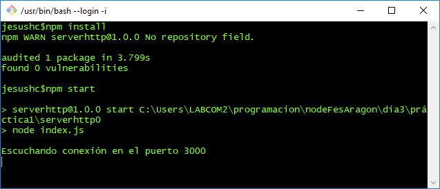

# paquete http de node.js
http es un paquete del core de Node.js que nos permite crear un servidor de páginas web de forma sencilla y es el módulo base para la construcción del modulo express, el  objetivo de este curso.

A continuación se exploran las caracterisitcas base de este módulo a traves de  un proyecto, en diversas versiones, las cuales van desde ```serverhttp0``` hasta el proyecto ```serverhttpN```. Mismos que van desde e servidor web mas simple , hasta el procesamiento de rutas http y servir archivos estáticos.

```http ``` forma parte del núcleo de Node.js y como tal no tiene una versión especifica, ya que se administra con la versión general de Node.js. Http es un módulo que habilita acceso a internet a tu programa.

Su principal funcion es ``` createServer() ```  la cuál recibe como argumento una función anónima que precesará las peticiones, pero además se quedará a la escucha de forma continua. A esta función se le conoce como la funcion ```requestListener ```. Ahora, esta funcion recibe dos objetos http.ServerRequest que representa la petición al servidor y un objeto que representa la repuesta que se le dará al cliente.

request recibe la información de la peticion de la página http tales como información de un formulario, verbo de la petidion (GET, POST) y el cuerpo de la petición (si es el caso).

response, es el objeto en donde se debe escribir la respuesta para mandarla al programa cliente(Chrome por ejemplo).

El siguiente código corresponde a la versión minima de un servidor web, sin embargo este código en particular aun no envía respuesta.

```
var Http = require('http');
var server = Http.createServer();

server.listen(3000, function() {
  console.log('Escuchando conexión en el puerto 3000');
});


```

#### serverhttp0


1. Ingresa a la carpeta ```serverhttp0 ``` instala el proyecto con ```nom install ```y ejecuta  con ``` npm start ```.

  

2. Esto producirá que el servidor empiece a escuchar en el puerto de red 3000. Entra a la dirección ```localhost:3000 ``` y observa que el servidor aun no responde, debido a que no hemos indicado como responder a una petición.

  


  En el siguiente código se agrega ka función anónima antes mencionada.

3. Antes de abrir la versión ``` serverhttp1 ```   del proyecto, codifica ``` seerverhttp0 ```  para que sea igual a lo siguiente:   


#### serverhttp1

```
  var Http = require( 'http' );
  var server = Http.createServer(function(request,response){
      console.log('Alguien entró');
  });

  server.listen( 3000, function( ) {
    console.log( 'Escuchando conexión en el puerto 3000' );
  });

 ```

3. Ejecuta nuevamente el proyecto del código ``` serverhttp1 ``` para obtener el resultado de la siguietne imagen cada vez que ingresemos vía el web browser.


Nota.- La función recien agregada, es una función callback que se ejecuta de forma asíncrona.

Cómo se puede observar la función requestListener responde con un  ```console.log('Alguien entró') ``` cada vez que un usario ingresa a la dirección web del servidor en el puerto 3000.

Al igual que el ejercicio anterior el web browser se queda en espera de la respuesta, debido a que no hemos escrito nada de el objeto ```request ```, avancemos y agreguemos una respuesta.

#### serverhttp2

```
var Http = require( 'http' );
var server = Http.createServer(function(request,response){
    console.log('Alguien entró');
    response.write("Hola desde el node");// no se envía por que no se indica fin de la respuesta

});

server.listen( 3000, function( ) {
console.log( 'Escuchando conexión en el puerto 3000' );
});

```

Al probar el programa el resultado debe ser el mismo, a pesar que ya se está 


