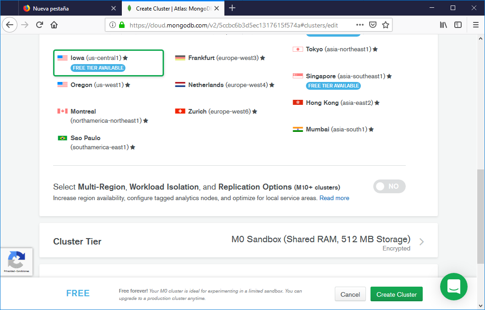
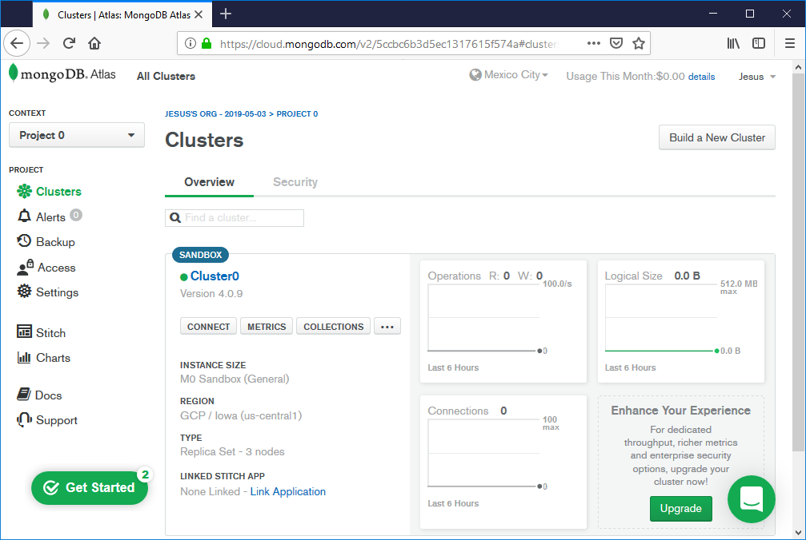
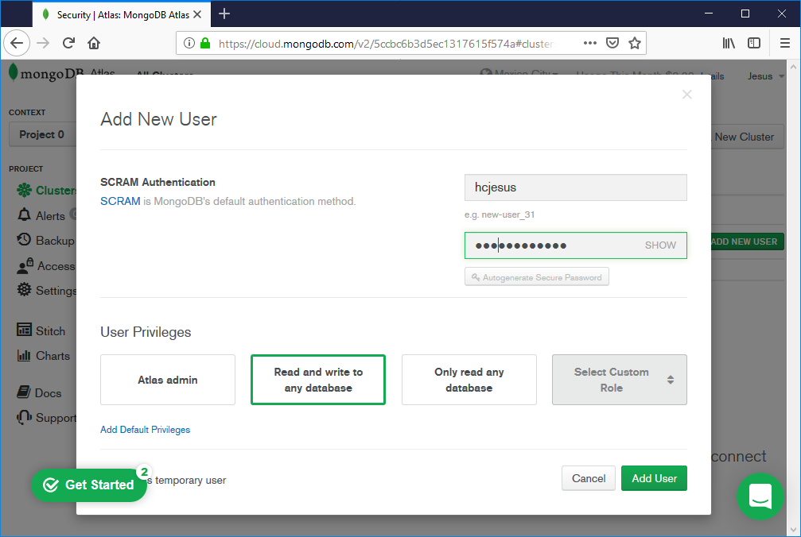
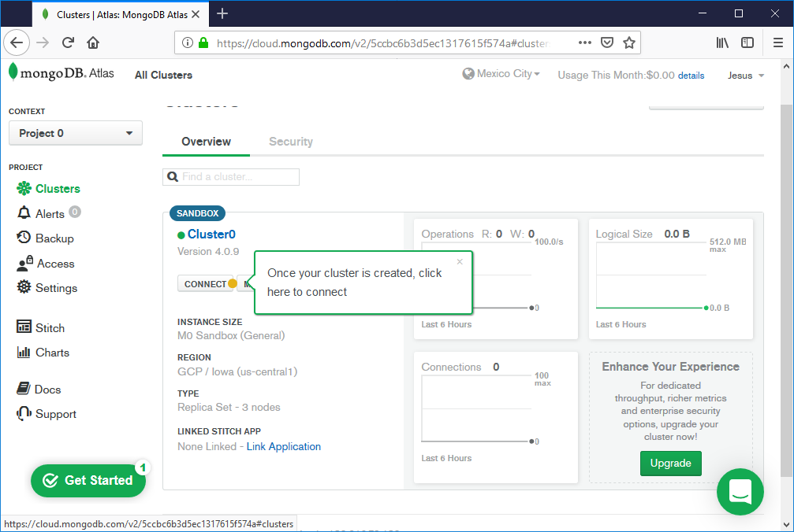
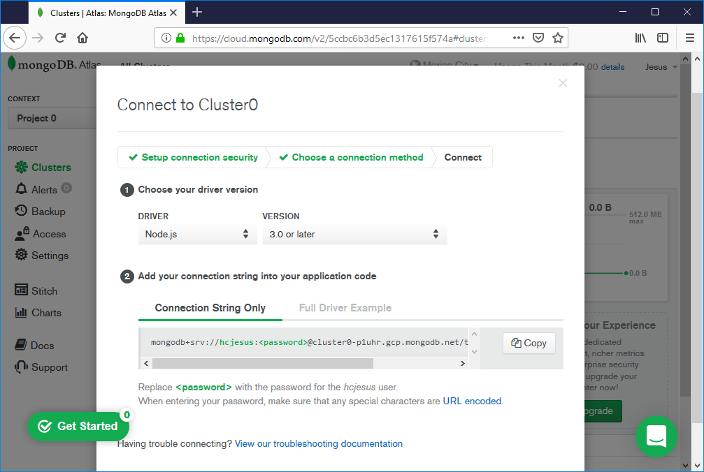

# MongoDB
MongoDb es una base de datos no relacional, lo cuál significa que emplea el lenguaje SQL para la administración de datos, tampoco emplea el concepto de tabla y relación de tablas.

En su lugar, mongo utiliza notación JSON, en donde al objeto común JSON le establece la nomenclatura de documento, es decir, para Mongo lo siguiente es un documento:


```
{"nombre":"Juan"}
```

el siguiente tambien:
```
{
  "numCliente": 1234,
  "telefonos":["04455-2345-2344","55-3987-3432","(721)33221212"],
   "activo":true,
   "balance":231521.89,
   "prestamos":null
}
```

**Documentos embebidos**
Mongo tambien maneja el concepto *documento embebido*, para explicarlo tenemos el siguiente ejemplo:
```
{
  "numCliente": 1234,
  "nombre":{
            "primerNombre":"Mario",
            "segundoNombre":null,
            "apellidoPaterno":"Pérez",
            "apellidoMaterno":"García"
          },
   "activo":true,
   "balance":231521.89,
   "prestamos":null
}
```
Donde la parte derecha de ``` nombre ``` es un documento embebido.


### Tipos de datos Mongo
**null**.- Se usa para representar nulo o valor inexistente. ``` {"a" : null} ```

**boolean**.- true o flase. ``` {"a" : true} ```

**number**.- Enteros o punto flotante. ``` {"a" : 1.83} ó{"b" : 22} ```
Tambíen se puede declarar de la forma ``` {"a" : 1.83} ó{"b" : 22} ``` o ``` {"a" : NumberInt("3")} 4 bytes ó {"b" :  NumberLong("22")} 8 bytes```

**array** arreglos de valores o de documentos embebidos. ``` {"a" : ["x", "y", "z"]} ```

**string** Cadena de caracteres UTF-8.

**date** Fechas. {"a":new Date()}

**regular expression** ``` {"a":/patron/ig} ```

**objectId** Este tipo de dato es empleado por mongo para establecer un valor único a un documento. El objetivo es diferenciar dos documentos cuando  ambos tienen el miso contenido. Agrega el campo **_id** de doce bytes.
Pero tambien se puede asignar  a algún valor de forma explicita ``` {"x" : ObjectId()} ```

https://docs.mongodb.com/manual/introduction/

## Operaciones basicas CRUD
Las Operaciones basicas de manipulación de dats en mongo es por medio de funciones, a continuación se muestra la sintaxis de cada una.

https://docs.mongodb.com/manual/crud/
  ### Create

  #### insertOne()
  Inserta solamente un documento:
      ```
      db.contactos.insertOne(
      {
      "nombre":"Juan",
      "Telefono":"55-2424-3535"
      }
      )
      ```

  #### insertMany()
  Inserta varios

  ### Read
    #### find()
    #### findOne()
  ### Update
    #### update()
    #### updateMany()
    #### replaceOne()
  ### Delete
    #### deleteOne()
    #### deleteMany()
## Creación de una cuenta DBaaS en MongoDB Atlas.











