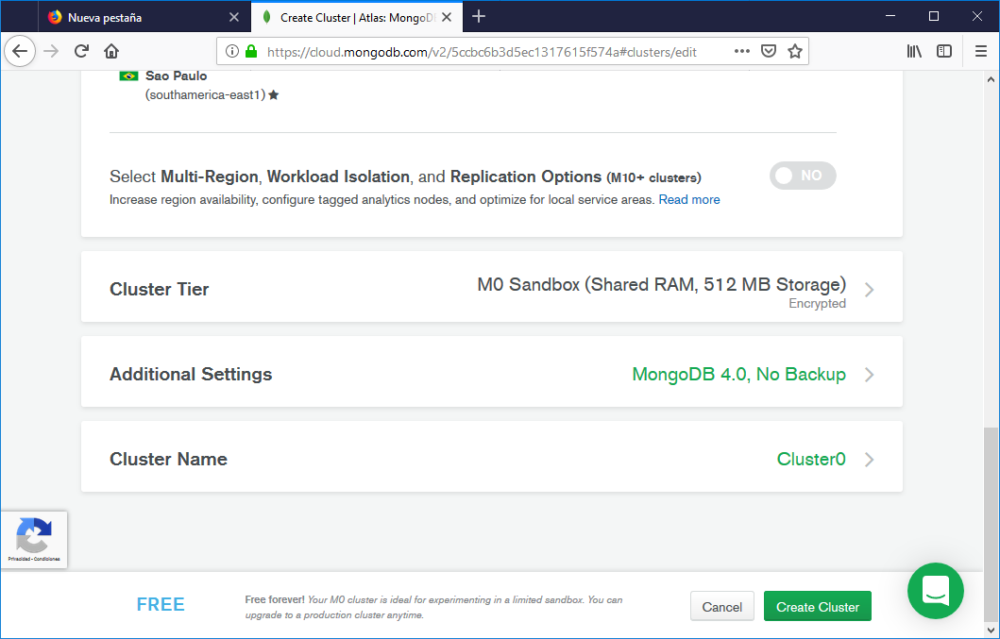
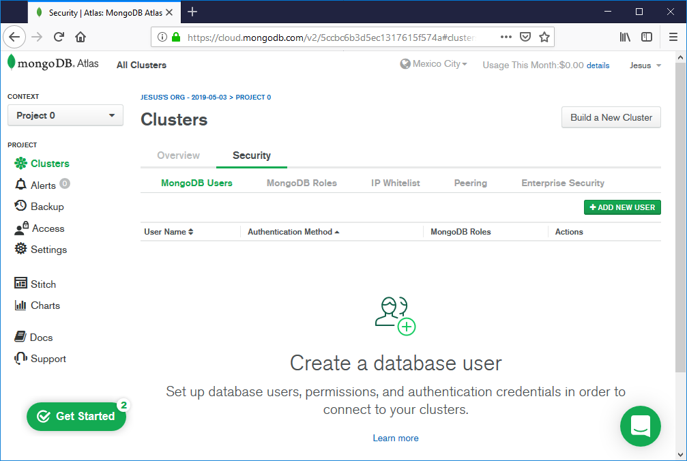
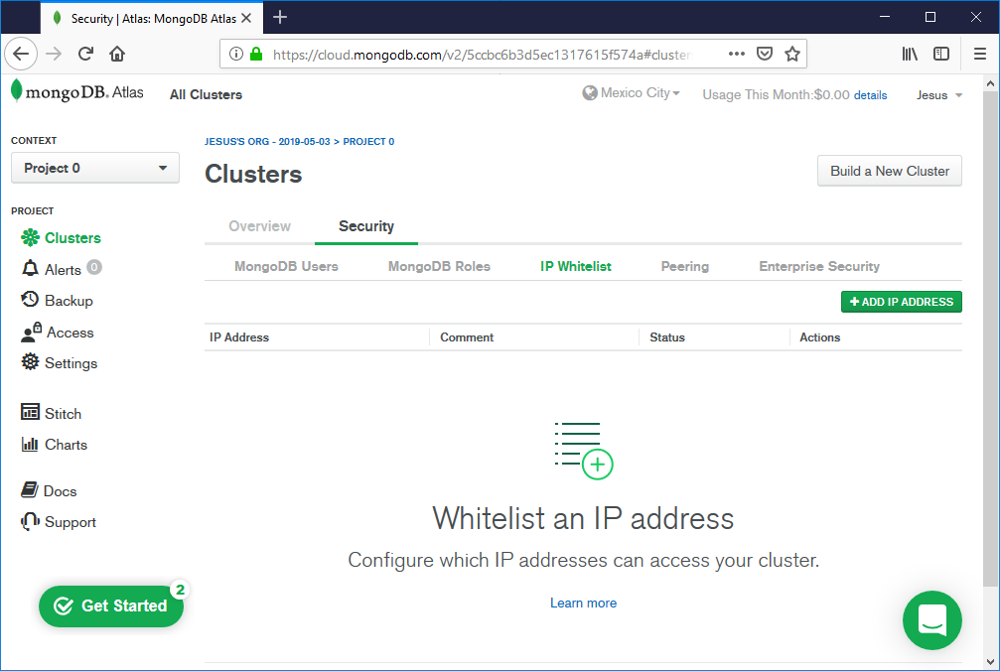
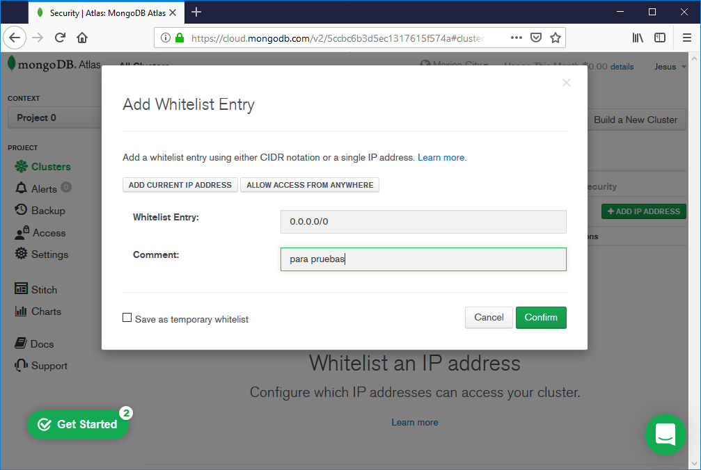

# MongoDB

MongoDb es una base de datos no relacional, lo cuál significa que **NO** emplea el lenguaje SQL para la administración de datos, tampoco emplea el concepto de tabla y relación de tablas.

En su lugar, mongo utiliza notación JSON, en donde al objeto común JSON le establece la nomenclatura de documento, sin embargo su almacenaje es en formato binario es por eso que dichos documentos son conocidos como **BSON documents**. Ademas de tener una representación binaria, tiene más tipos de datos que el tradicional JSON.


Para Mongo lo siguiente es un documento:


```
{"nombre":"Juan"}
```

el siguiente tambien:
```
{
  "numCliente": 1234,
  "telefonos":["04455-2345-2344","55-3987-3432","(721)33221212"],
   "activo":true,
   "balance":231521.89,
   "prestamos":null
}
```

**Documentos embebidos**
Mongo tambien maneja el concepto *documento embebido*, para explicarlo tenemos el siguiente ejemplo:
```
{
  "numCliente": 1234,
  "nombre":{
            "primerNombre":"Mario",
            "segundoNombre":null,
            "apellidoPaterno":"Pérez",
            "apellidoMaterno":"García"
          },
   "activo":true,
   "balance":231521.89,
   "prestamos":null
}
```
Donde la parte derecha de ``` nombre ``` es un documento embebido.

## Colecciones
Al conjunto de documentos BSON, MongoDB le asigna el nombre(concepto) de Colección; una colección a su vez es almacenada en una base de datos ```db```.
Al momento de insertar un documento, si no existe la colección, Mongo la crea. Tambien en tiempo de ejecución la estructura de una colección puede cambiar, es decir los campos de los documentos que almacena pueden modificarse (crecer o disminuir) en tiempo de ejecución. Esta caracteristica es la que le da alto rendimiento. Sin embargo se delega al programador establecer integridad y consistencia vía código fuente.


### Tipos de datos Mongo
**null**.- Se usa para representar nulo o valor inexistente. ``` {"a" : null} ```

**boolean**.- true o false. ``` {"a" : true} ```

**number**.- Enteros o punto flotante. ``` {"a" : 1.83} ó {"b" : 22} ```
Tambíen se puede declarar de la forma ``` {"a" : 1.83} ó {"b" : 22} ``` o ``` {"a" : NumberInt("3")} 4 bytes ó {"b" :  NumberLong("22")} 8 bytes```

**array** arreglos de valores o de documentos embebidos. ``` {"a" : ["x", "y", "z"]} ```

**string** Cadena de caracteres UTF-8.

**date** Fechas. ```{"a":new Date()}```

**regular expression** ``` {"a":/patron/ig} ```

**objectId** Este tipo de dato es empleado por Mongo para establecer un valor único a un documento. El objetivo es diferenciar dos documentos cuando  ambos tienen el mismo contenido. Agrega el campo **_id** de doce bytes.
Pero tambien se puede asignar  a algún valor de forma explicita ``` {"x" : ObjectId()} ```

https://docs.mongodb.com/manual/introduction/

## Operaciones basicas CRUD
Las Operaciones basicas de manipulación de datos en Mongo es por medio de funciones, a continuación se muestra la sintaxis de cada una.

La documentación básica se encuentra en :
https://docs.mongodb.com/manual/crud/

Una página con un shell interacrtivo para hacer consultas CRUD se encuentra en este link: https://docs.mongodb.com/manual/tutorial/query-documents/.

  ### Create

  #### insertOne()

  Inserta solamente un documento, el siguiente código inserta un documento a la colección contactos.

  ```
      db.contactos.insertOne(
      {
      "nombre":"Juan",
      "telefono":"55-2424-3535",
      "edad":22
      }
      )
  ```

  #### insertMany()
  Inserta varios documentos que le son enviados en un arreglo.

  ```

  db.contactos.insertMany(
  [ {
  "nombre":"Juan",
  "telefono":"55-2424-3535",
  "edad":22
  },{
  "nombre":"Mario",
  "Telefono":"55-3422-7766",
  "edad":25
  } ]
  )
  ```

  ### Read
  #### find()
  La función ```db.contactos.find()``` regresa todos los documentos dentro de la colección contactos.

  Para hacer lo equivalente a un ``` where nombre="Juan" ``` es como sigue:
  ```
  db.contactos.find({
      "nombre":"Juan"
    })
  ```
Para hacer una consulta equivalente ``` edad > 23 ``` se emplea el operador ```$gt ```:
```
db.contactos.find({
    "edad":{$gt:23}
  })
```
### Listado de operadores relacionales

    - Creación de un servidor con el paquete ```http```.
    - $eq -equal - igual
    - $lt - low than - menor que
    - $lte - low than equal - menor o igual que
    - $gt - greater than - mayor que
    - $gte - greater than equal - mayor o igual que
    - $ne - not equal - distinto
    - $in - in - dentro de
    - $nin - not in - no dentro de


#### findOne()
La función findOne regresará solamente el primer registro encontrado según los criterios de busqueda. Por ejemplo la siguiente consulta regresa solamente el primer registro con edad mayor de 20.
```
db.contactos.findOne({"edad":{$gt:20}});

```


### Update
  La sintaxis para hacer un update es ```db.collection.update(query, update, options) ``` con mayor detalle:

```
db.collection.update(
   <query>,
   <update>,
   {
     upsert: <boolean>,
     multi: <boolean>,
     writeConcern: <document>,
     collation: <document>,
     arrayFilters: [ <filterdocument1>, ... ]
   }
)
```
En donde el query es la sección donde se eligen los documentos a modificar. En la sección update se establecen los nuevos valores. y la ultima sección se establecen parametros de la funcion update:

```
upsert	boolean	Optional. Si es establecido a true, significa que se insertará un nuevo documento si no se encuentra el documento.

multi	boolean   opcional. Si es establecido a true, modifica multiples documentos.

```

#### update()
Ejemplo, para modificar la edad de Juan a 33 se realiza de la forma:
```
db.contactos.update(
  {"nombre":"Juan"},
  {"nombre":"Juan","telefono":"55-2424-3535","edad":33},
  {upsert:true}
  );
```
Resultado:


#### updateMany()
Sigue la misma sintaxis:    ```db.collection.update(query, update, options) ``` sin embargo modifica todos los registros que conicidadn con la sección ```query```.


#### replaceOne()
Reemplaza un documento en base a las coincidencias de la seccion filter: ```db.collection.replaceOne(filter, replacement, options)```  


### Delete
Eliminar documentos de una colección, con la notación: ``` db.collection.deleteOne(<filter>,<options>) ```
#### deleteOne()
Ejemplo: Eliminar al contacto de nombre Juan y edad 33
```
db.contacto.deleteOne({
  "nombre":"Juan",
  "edad":33
  });

```

## Creación de una cuenta DBaaS en MongoDB Atlas.
La siguiente es la guía para crear una base de datos en MongoDB Atlas.

1. Accede a la direccion http://mlab.com y selecciona el boton azul con la leyenda ``` signup ``` para crear una cuenta.

  

2. Al terminar de crear la cuenta y acceder a la misma te solicitará crear tu primer cluster.


3. Selecciona AWS o Google que tienen una capa gratuita.


4. En la siguiente pantalla elige la region donde se creará tu BD. (IOWA gratis).


5. Por ùltimo presiona el botón crear cluster para finalizar.



6. La siguiente imagen muestra cuando tu cluster mongo esta creado. El siguiente paso es crear cuantas de acceso para conectarnos desde node.


7. Selecciona la pestaña security y da de alta un unsario ``` ADD NEW USERS ```



8. ingresa un nombre de usuario, una contraseña y establece los permisos de lectura y escritura en cualquier BD.
Finalizar seleccionando el botón Add user.


9. Selecionar La pestaña IP WhiteList ny el botón verde ``` ADD IP ADDRESS ```




10. ingresa el valor 0.0.0.0/0 para indicar que queremos tener acceso desde cualquier IP (recomendable solo para pruebas).




.por ùltimo seleccionamos el botón connect


seleccionamos la opción ``` CONNECT YOUR APPLICATION ``` Y copiamos la URL de conexión, que emplearemos en la siguiente práctica.


