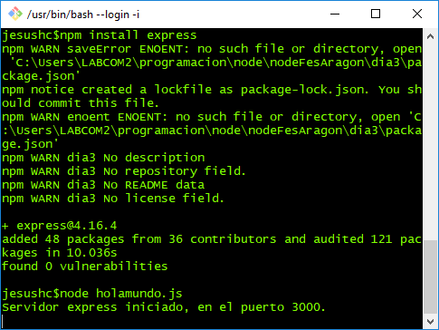
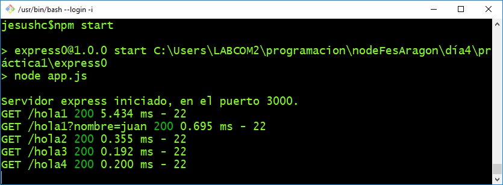

# Introducción al framework Espress.js
#### Qué es Express.
Es un framework para el desarrollo de aplicaciones Web basado en el paquete http de Node.js  y  el módulo [Connect](https://github.com/senchalabs/connect), que se encarga de unir otros módulos para expandir la funcionalidad de Express(Middleware).

Este framework automatiza las actividades repetitivas al escribir aplicaciones web de forma tradicional como por ejemplo:

- Extrayendo los parametros de un formulario.
- Extracción de datos de los cuerpos HTTP (request bodies).
- Manejo de rutas anidando estructuras if.
- Parsing de  cookies
- manejo de sesiones de cliente.
- Estableciendo las cabeceras http de acur¿erdo con la respuesta.
- Manejo de errores.

Express esta escrito para reutilizar estas caracterisitcas de forma elegante con una arquitectura parecida al MVC (Modelo-Vista-Controlador).

# empecemos con un ejemplo básico

1.- El hola mundo clásico y obligado.


```
//holamundo.js
var express = require("express");
var app = express();
app.get("/", function(request, response) {
  response.send("¡Hola mundo Express !");
});

app.listen(3000, function() {
  console.log("Servidor express iniciado, en el puerto 3000.");
});
```




## Manejo de rutas

Com ya se mencionó antes express simplifica muchas tareas tediosas de programar solamente con http, una de ellas en manejar rutas. En lugar de tener lo siguiente con http:
```
var uri = (request.connection.encrypted ? 'https': 'http') + '://' + request.headers.host + request.url;
  var uri_parseada = url.parse(uri,true);
  console.log(uri_parseada);
  console.log('----------------------------');
  console.log(uri_parseada.path);

  if (uri_parseada.path=="/hola" && request.method == 'GET'){
  	console.log(request.method);
  	response.writeHead(200,"Content-Type:text/html");
  	response.write('<h1> Hola </h1>');
    response.end();
  }


```
en express tenemos lo siguiente:

```
app.get('/hola', function (request, response) {
  response.send('<h1> Hola </h1>');
});
```

En la [documentación de Express](https://expressjs.com/es/starter/basic-routing.html) para direccionamiento se tiene que:

```
app.METHOD(PATH, HANDLER)
```

Donde:

*app es una instancia de express.
METHOD es un método de solicitud HTTP.
PATH es una vía de acceso en el servidor.
HANDLER es la función que se ejecuta cuando se correlaciona la ruta.*

De tal forma que se simplifica la determinacion de Path y Metodo http. Por lo cual si quisieramos escribir una resppuesta direrente para el metodo POST para la misma ruta se escribiría de esta forma:
```
app.post('/hola', function (request, response) {
  response.send('<h1> Hola con POST </h1>');
});
```


### Crear un proyecto express con npm init

2. Ejercicio
  - Entrar a la carpeta express0 e invocar el comando **npm init**
    - Configurar la app con tus propios datos
    - Establece el entry point de (index.js) a **app.js**
  - Instala express en la aplicacion con el comando:
    ```
    npm install express --save
    npm install morgan --save
    ```
  - En el archivo package.json modificar el script start por ``` "start":"node app.js" ```
  - Crear el archivo app.js e ingresar el siguietne contenido:

    ```
    var express = require("express");
    var port = 3000;
    var app = express();
    var logger = require('morgan');

    app.use(logger('dev'));
    app.get("*", function(request, response) {
      response.send("¡Hola mundo Express !");
    });

    app.listen(port, function() {
      console.log("Servidor express iniciado, en el puerto 3000.");
    });
    ```

#### morgan: HTTP request logger middleware para node.js
Morgan es un manejador de bitacoras para node.js, y con el uso del modulo Connect lo agregamos a Express.js como un Middleware, es decir funcionalidad intermediaria.



## Archivos estáticos
Cómo es esperado, las aplicaciones web deben solicitar múltiple tipo de archivos, por ejemplo hojas de estilo, imagenes y JS. Sin embargo para servirlos con el paquete http tradicional se requeriría hacer una evaluación de rutas muy exahustiva. Para facilitar el procesamiento de este tipo de recursos, express permite incluir un módulo com Middleware de la forma:


```
var path=require('path');

var publicPath = path.resolve(__dirname, "public");
app.use(express.static(publicPath));
```
La función resolve establece su variable interna apunte al directorio public, en donde pondremos todos los archivos estáticos y de esta forma es posibleservir, archivos html, imagenes y CSS.
En el proyecto **express1** ya se encuentra el recurso público **index.html** al probar el proyecto en la ruta **http://localhost:3000/index.html** el resultado es el siguiente.


3. Ejercicio.
  - Agregar un archivo master.css
  - agregar una regla css para cambiar el color de el tag H1 a verde.
  - Agregar una imagen desde el directorio *public*
  - Resultado esperado:
  

# Express generator
